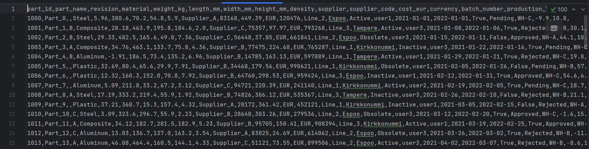
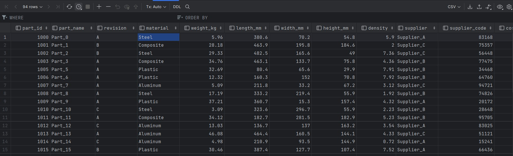

# Data Migration Project: CSV to SQLite Sandbox

## 📌 Project Overview
This is a **learning project** designed to demonstrate a foundational ETL (Extract, Transform, Load) pipeline. It simulates a real-world scenario where legacy data stored in flat files (CSV) needs to be migrated into a relational database (SQLite) for better data integrity and querying capabilities.

The project covers:
- Data ingestion using `pandas`.
- Relational database schema creation using `sqlite3`.
- Project environment management and version control best practices.

##  Features
- **Robust Path Management**: Uses `pathlib` to ensure scripts run correctly regardless of the user's current working directory.
- **Automated Schema Creation**: Automatically generates a `parts` table in the SQLite sandbox upon execution.
- **SQL Integration**: Demonstrates how to bridge the gap between Python data structures and SQL databases.

##  Project Structure
- `Data/`: Contains `legacy_parts.csv` and the transformed `cleaned_parts.csv`.
- `db/`: Storage location for the `sandbox.db` SQLite file.
- `Scripts/`: 
    - `load_to_sqlite.py`: The main migration script.
    - `validate_sql.py`: A utility script to verify data was loaded correctly.
- `.gitignore`: Configured to keep the environment (`venv/`) and system files out of version control.

## 🔄 Before vs After Migration

###  Before Migration – Legacy CSV
The legacy data exists as a flat CSV file without enforced schema or constraints.



---

###  After Migration – SQLite Sandbox Database
After validation and transformation, the data is migrated into a structured SQLite database with enforced data types and improved integrity.



##  How to Run

### 1. Prerequisites
Ensure you have Python 3.x installed. It is recommended to use a virtual environment.

### 2. Setup
Clone the repository and install dependencies:
```bash
# Create and activate virtual environment
python -m venv venv
source venv/Scripts/activate  # On Windows: venv\Scripts\activate

# Install pandas
pip install pandas
